# 🚀 InternTrack Pro — Institutional Internship & Placement Governance Platform
## Complete Hackathon Documentation, Technical Architecture, System Thinking & Pitch Deck Guide

---

## 📌 1. Executive Summary & Problem Statement

### 🎯 The Real-World Problem
In university ecosystems across India and globally, managing **campus placements and mandatory internships** (such as AICTE/UGC credit mandates) is notoriously fragmented, manual, and vulnerable:
1. **Data Silos & Fake Submissions**: Students submit unverified self-placement certificates or edited offer letters. Faculty mentors lack direct visibility into company supervisors and real daily attendance.
2. **Eligibility Headaches**: T&P (Training & Placement) cells spend hundreds of hours manually verifying CGPA cutoffs, active backlogs, departmental criteria, and passing years for dozens of company drives.
3. **Ghosting & Communication Gaps**: Candidates miss interview slots; companies struggle with multi-round status updates; faculty have no unified portal to approve weekly logs.
4. **Certificate Fraud**: Employers and external universities cannot instantly verify the authenticity of completed internship certificates or college clearance NOCs.

### 💡 The Solution: InternTrack Pro
**InternTrack Pro** is an institutional-grade, **4-role placement and internship lifecycle management ecosystem** built for Students, Recruiters, Faculty Mentors, and University Placement Administrators. It orchestrates the entire journey from **candidate registration, AI matching, and eligibility filtering to multi-round interview pipelines, dual-tier weekly work verification, live attendance tracking, and cryptographically verified completion certificates**.

---

## 🏗️ 2. High-Level Architecture & Design Decisions

```mermaid
graph TD
    subgraph Client [Client-Side Layer - Next.js 16 + React 19 + Tailwind CSS]
        A[Student Portal]
        B[Recruiter / Company Portal]
        C[Faculty Mentor Review Hub]
        D[T&P Cell Administration]
    end

    subgraph StateLayer [Local-First Reactive State & Sync Engine]
        E[React Context + React Hooks Store]
        F[BroadcastChannel Cross-Tab Bus]
        G[LocalStorage / SessionStorage Offline Vault]
    end

    subgraph ServerLayer [Serverless Next.js API Routes]
        H[/api/portal/sync - Atomic Cloud Sync & Merging]
        I[/api/portal/verify - Cryptographic Document Engine]
        J[/api/ai/recommendations - Smart Eligibility Engine]
    end

    subgraph DatabaseLayer [Cloud Persistence]
        K[(Supabase Cloud PostgreSQL DB)]
    end

    Client --> StateLayer
    StateLayer --> ServerLayer
    ServerLayer --> DatabaseLayer
```

### 🧠 Core Architectural Thinking

| Requirement | Architectural Decision | Engineering Rationale |
| :--- | :--- | :--- |
| **Instant 0ms Reactivity** | **Local-First Architecture with Cloud Sync** | High-traffic campus placement days cause network congestion. Local state ensures students never face UI freezes during drive deadlines or test submissions. |
| **Zero-Loss Cross-Tab Sync** | **BroadcastChannel API + Non-destructive Merging** | When a recruiter shortlists in Tab A and schedules in Tab B, state broadcasts instantly with 0ms network latency and zero egress cost. |
| **File Security & Unsafe Upload Defense** | **Binary Magic-Byte Inspection** | Prevents disguised script execution (`.php`, `.exe`, `.html`) by analyzing the binary file header directly in the browser before payload generation. |
| **Institutional Trust** | **Tamper-Proof Verification Codes (`/verify/[code]`)** | Every generated certificate, offer letter, and NOC gets an unforgeable institutional verification code accessible via QR or public URL. |
| **Multi-Persona Isolation** | **Contextual Auth Session Resolvers** | Allows instant switching between personas (Student, Recruiter, Faculty, Admin) during hackathon evaluations without session collisions or data leaks. |

---

## 🔄 3. End-to-End Lifecycle State Machine

```mermaid
stateDiagram-v2
    [*] --> StudentRegistration: Candidate Signs Up (/register/student)
    StudentRegistration --> AdminVerification: Awaits KYC & Document Check
    AdminVerification --> AccountApproved: T&P Admin Approves Account
    AccountApproved --> DriveDiscovery: Browses Live Drives (/drives)
    DriveDiscovery --> ApplyToDrive: Automated Eligibility Pass (/drives/id)
    ApplyToDrive --> UnderReview: Company Receives Application
    UnderReview --> Shortlisted: Recruiter Reviews Candidate
    Shortlisted --> InterviewScheduled: Interview Slot Assigned
    InterviewScheduled --> CandidateSelected: Clears Interview Rounds
    CandidateSelected --> ActiveInternship: Student Accepts Offer
    ActiveInternship --> WeeklyReporting: Student Submits Weekly Logs
    WeeklyReporting --> CompanyVerification: Supervisor Verifies Work Done
    CompanyVerification --> FacultyReview: Faculty Mentor Approves Credits
    FacultyReview --> FinalEvaluation: 100% Milestones & Attendance Met
    FinalEvaluation --> Completed: Institutional Certificate Issued
    Completed --> [*]
```



### 📋 Walkthrough of the 6 Core Workflows

#### 1. 🎓 **Registration & Verification Stage**
- Candidate registers with Enrollment Number, Branch, Passing Year, CGPA, Backlogs, Resume, and Student ID card.
- Recruiter registers with Company MCA Incorporation Certificate, HR details, and domain.
- T&P Admin reviews raw documents in `/admin/verifications` and clicks **Approve** or **Reject with Reason**.

#### 2. 🏢 **Drive Publishing & Dynamic Eligibility Engine**
- Companies publish drives with customizable filters: Minimum CGPA, Backlog limit, Branch restrictions, and Passing Year.
- Automated eligibility engine checks candidate profiles in real time, displaying color-coded eligibility badges (`Eligible`, `Not Eligible`, `Missing Information`) and actionable gap checklists.
- Automated lifecycle categorization sorts drives into `Active Drives`, `Expired Drives`, and `Completed Drives`.

#### 3. 🎯 **Application, Shortlisting & Interview Pipeline**
- Eligible students apply with 1-click submission.
- Recruiters manage candidate pipelines in `/company/applicants`:
  - **Mark Under Review**
  - **Shortlist Candidate**
  - **Schedule Interview** (Assigns Date, Time, Online Meeting Link / In-Person Venue, Panelists, and Instructions)
  - **Select Candidate**

#### 4. 🤝 **Selection & Automatic Internship Initialization**
- Selected student receives automated notification and clicks **Accept offer & start internship**.
- System automatically initializes:
  - Active `Internship` record with start and end dates.
  - Dedicated daily & weekly **Attendance Tracking Ledger**.
  - Institutional **Document Management Ledger** (Offer Letter & Acceptance Clearance).
  - Unlocks **Weekly Work Report submissions** (`/reports`).

#### 5. 📝 **Dual-Tier Weekly Report & Attendance Loop**
- **Step 1 (Student)**: Student logs hours worked, work done, skills acquired, and attaches screenshots/PDF or Google Drive links (`/reports`).
- **Step 2 (Company)**: Recruiter verifies work samples and approves report in `/company/feedback`.
- **Step 3 (Faculty Mentor)**: Mentor reviews verified logs in `/faculty/reviews`, clicks **View Evidence** to inspect documents in the modal viewer, and approves institutional credits.

#### 6. 🏆 **Self-Placement & Completion Certificate Verification**
- Off-campus internships found independently are registered in `/self-placement` with Offer Letter, Joining Letter, and NOC attachments.
- Faculty approves to activate university credit tracking.
- On final evaluation, an official **Completion Certificate** with QR verification code is generated, verifiable at `/verify/[code]`.

---

## 💻 4. Tech Stack & Engineering Highlights

| Layer | Technology | Key Highlights & Purpose |
| :--- | :--- | :--- |
| **Framework** | **Next.js 16.3 (Turbopack, App Router)** | Optimized server/client component boundaries, sub-second route transitions. |
| **Frontend UI** | **React 19, Tailwind CSS v4, Lucide Icons** | Fluid, mobile-responsive layout matching modern institutional dashboard standards. |
| **Component Kit**| **Radix UI & Shadcn Component Patterns** | Accessible modals, tabs, dialogs, progress bars, and dropdown primitives. |
| **State Sync** | **Local-First React Store + BroadcastChannel** | Instant cross-tab sync, 0ms local responsiveness, zero data loss on refreshes. |
| **Backend & Sync** | **Next.js Serverless API Routes** | Atomic registration sync, non-destructive entity merging, deep integrity checks. |
| **Database** | **Supabase Cloud (PostgreSQL DB)** | Persistent cloud storage for students, companies, drives, applications, and logs. |
| **Security** | **Client-side Magic-Byte Validator** | Pre-upload binary signature inspection blocking malicious scripts. |
| **Verification** | **Public Cryptographic Verifier (`/verify/[code]`)** | Tamper-proof institutional verification for recruiters and universities. |
| **Notifications** | **Sonner Toast Engine** | Real-time user feedback for status changes, emails, and drive notifications. |

---

## ❓ 5. Anticipated Judge / Jury Questions & Winning Answers

### Q1: *"What happens if internet connectivity drops during an on-campus placement drive?"*
> **Answer**:  
> *"We engineered InternTrack Pro with a **Local-First Architecture**. All mutations (applications, evaluations, reports) update React in-memory state and snapshot to encrypted LocalStorage synchronously. BroadcastChannel synchronizes across tabs with zero network latency. When connectivity resumes, the background debounced sync engine commits all changes to Supabase via our atomic `/api/portal/sync` endpoint with non-destructive entity merging."*

### Q2: *"How do you prevent students from uploading fake or malicious files?"*
> **Answer**:  
> *"We implemented a multi-layered security engine in `lib/file-validation.ts`:*  
> 1. *Extension & MIME filtering.*  
> 2. *Client-side ArrayBuffer binary inspection to check authentic magic bytes (`%PDF-`, `PNG`, `JPEG`, `ZIP/DOCX`).*  
> 3. *Script injection scanning that rejects files containing embedded `<script>`, `<?php`, or executable tags.*  
> 4. *Direct Google Drive link integration with automated embed converters for large media."*

### Q3: *"How does the system handle students who find internships off-campus on their own?"*
> **Answer**:  
> *"Through our dedicated **Self-Placement Module** (`/self-placement`). Students register the company, upload their Offer Letter, Joining Letter, and college NOC. Faculty mentors inspect the submitted documents via our built-in **Document Viewer Modal** and approve the request, seamlessly bringing external internships under institutional credit tracking."*

### Q4: *"How do you prevent student eligibility disputes or companies violating university placement rules?"*
> **Answer**:  
> *"Our **Rule-Based Eligibility Engine** (`lib/eligibility.ts`) evaluates candidate CGPA, active backlogs, branch, passing year, and account approval status in real time before an application can be submitted. The button is disabled with explanatory criteria breakdown if rules are not met, eliminating disputes."*

### Q5: *"Can employers or third-party background checkers verify that a student actually completed the internship?"*
> **Answer**:  
> *"Yes. Every verified internship certificate generated by the system embeds a unique cryptographic hash and URL linking to our public verification portal (`/verify/[code]`), confirming the candidate's name, enrollment, company, dates, and faculty sign-off."*

---

## 🎤 6. 3-Minute Hackathon Pitch Script

> **[0:00 - 0:30] Hook & Problem Statement**  
> *"Good morning, esteemed judges! Every year, colleges handle thousands of internship applications across spreadsheets, emails, and paper forms. Fake certificates slip through, faculty mentors have zero visibility into daily attendance, and placement officers spend hundreds of sleepless hours manually checking CGPAs and backlog criteria. Today, we are proud to introduce **InternTrack Pro** — the unified, institutional-grade placement and internship governance ecosystem."*

> **[0:30 - 1:15] Core Workflow & Live Demo**  
> *"InternTrack Pro connects all 4 key stakeholders in real time:  
> 1. **Students** discover drives, check eligibility with zero guesswork, and apply in 1 click.  
> 2. **Recruiters** filter applicants, conduct interview rounds, and track interns.  
> 3. **Faculty Mentors** verify weekly work reports with our embedded document viewer and supervise progress.  
> 4. **T&P Admins** govern institutional policies, audit logs, and compliance analytics."*

> **[1:15 - 2:00] Technical Innovation & Engineering Highlights**  
> *"Under the hood, InternTrack Pro runs on **Next.js 16 with Turbopack and React 19**. We implemented a **Local-First reactive sync engine** with BroadcastChannel that guarantees 0ms latency, zero data loss, and seamless cloud synchronization with Supabase. We also integrated client-side binary magic-byte security and public tamper-proof certificate verification."*

> **[2:00 - 2:45] Market Impact & Scalability**  
> *"InternTrack Pro directly fulfills AICTE & UGC mandatory internship guidelines, saving universities hundreds of administrative hours while eliminating certificate fraud. It is production-ready, mobile-responsive, and deployed live."*

> **[2:45 - 3:00] Closing Call to Action**  
> *"Thank you, and we welcome your questions!"*

---

## 🗺️ 7. Hackathon Live Demo Navigation Map

| Workflow | URL Route | Key Features to Highlight |
| :--- | :--- | :--- |
| **1. Student Discovery** | `/drives` & `/drives/[id]` | Automated eligibility checker, expired/completed tabs, 1-click apply |
| **2. Recruiter Management** | `/company/applicants` | Live candidate pipeline, resume viewer modal, interview scheduler |
| **3. Student Applications** | `/applications` | Pipeline tracker, interview acknowledgement, offer acceptance |
| **4. Weekly Work Logs** | `/reports` | Work logged, hours tracked, file upload + Google Drive link |
| **5. Supervisor & Faculty Review** | `/company/feedback` & `/faculty/reviews` | Multi-tier verification, DocumentViewerModal, grade approval |
| **6. Off-Campus Self-Placement** | `/self-placement` | NOC upload, joining letter verification, faculty activation |
| **7. Public Certificate Verification** | `/verify` & `/verify/[code]` | QR code scan, institutional letterhead, anti-tampering verification |
| **8. T&P Administrative Hub** | `/admin/verifications` & `/admin/audit` | KYC approval queue, live placement stats, audit log trails |

---
*Created for Hackathon Presentation & Technical Evaluation.*
